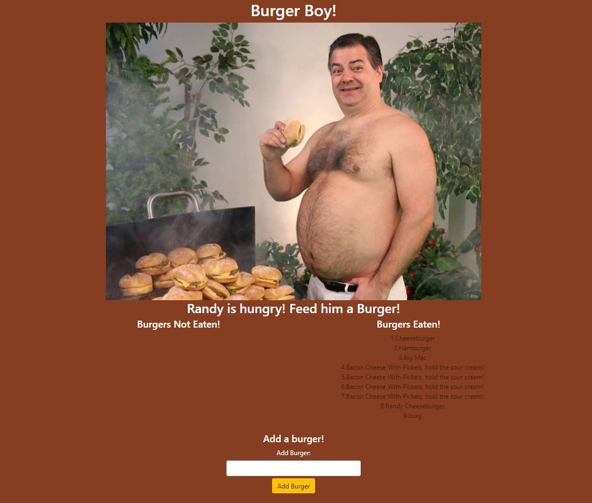

# Eat Da Burger

### Overview

Our assignment was to create a burger logger using MySQL, Node, Express, Handlebars and our own ORM. The objective was to allow a user to type in a burger of their choice, hit the add button and log it to a database. The user can then hit the "Devour It" button and move the item into the "Burgers Eaten" column/database.

---

## NPM Packages

* express
* express-handlebars
* mysql

---

## Technologies Used

* HTML
* CSS
* Bootstrap
* Handlebars
* Javascript
* Node.js
* jQuery
* Express.js
* MySQL
* AJAX

---

## File Structure

-Root
* server.js
* package.json
* config
  * connection.js
  * orm.js
* controllers
  * burgers_controller.js
* db
  * schema.sql
  * seeds.sql
* models
    * burger.js
* public
    * assets
        * css
            * burger_style.css
        * img
            * burger.jpeg
        * js
            * burger_script.js
* views
    * layouts
        * main.handlebars
    * index.handlebars
    
---

## Deployed Link:

[Eat Da Burger!](https://arcane-headland-60586.herokuapp.com/?burger_name=burg)

---

## Screenshot

